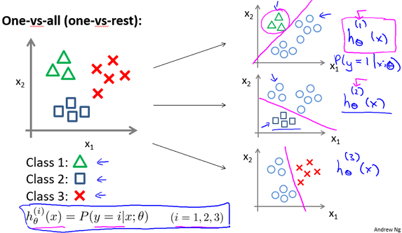

# Multi-Class Logistic Regression

| Problem	| Methods	| Libs	|
| ---       | ---       | ---   |
| Multi-Class Logistic Regression From Scratch| Logistic Regression, One-vs-Rest | `numpy` |

In this project, I am implementing a multi-class logistic regression classifier by generalizing binary logistic regression classifier. 

Some references suggest using MLT: Multi Class Logistic Regression algorithm to solve multi class problems with logistic regression. This method replaces the logistic function with softmax function, which is defined as:

Instead, I'll be using binary logistic model in my solution. 

I applied logistic regression for each class to calculate whether the test datapoint belongs to the given class or other classes (One-vs-Rest approach). Then I selected the class with highest probability of belonging to be the predicted class. Actually, these are not actual probabilities. Adding the predictions for each class do not add to one; which means we lose meaning of "probability" by using sigmoid function and comparing each class with others.

**Step 0**:

Import Iris dataset, define global variables like X_t: test sample and number of iterations for gradient descent.

**Step 1**:

Define sigmoid and cost functions.

Add X0 = 1 to test and training data (for theta0)

**Step 2**:

Define Gradient descent algorithm as

- for number of iterations
	- calculate  
	- Adjust weights  

**Step 3**: Build a model for each class

I modified the actual y values in order to construct these models. Each model is built to estimate y values s.t. 
- y_i = 1  if x_i is in desired class, and 
- y_i = 0, otherwise 

for each training point.

Then I used Gradient Descent algorithm to estimate theta values for each class. Cost for the final model is printed out.

**Step 4**: Define prediction function for the given test sample and theta values, which calculates

 

**Step 5**: 
Apply the predict function on test sample Xt for each class, i.e., predict with the thetas calculated in step 3 for each class.

**Step 6**: 
Select maximum prediction value, output it as the selected label.

The algorithm is implemented from scratch in [logistic.py](logistic.py). To run the algorithm with Iris dataset, simply run [driver.py](driver.py) file. 